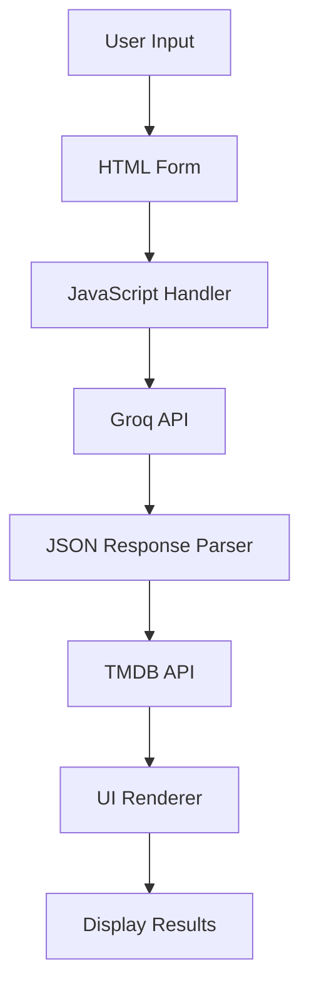

# Design Document

## Overview

The Movie Plot Finder is a client-side web application that processes user-inputted movie plot descriptions through Groq AI to identify movies and display comprehensive information including posters from TMDB API. The app uses a simple HTML/CSS/JavaScript architecture for maximum simplicity and portability.

## Architecture



The application follows a simple client-side architecture:
- HTML provides the structure and form interface
- CSS handles styling and responsive layout
- JavaScript manages API calls, data processing, and DOM manipulation
- External APIs (Groq and TMDB) provide movie identification and poster services

## Components and Interfaces

### HTML Structure
- **Input Form**: Text area for plot input and submit button
- **Results Container**: Section to display movie information
- **Loading Indicator**: Visual feedback during API calls
- **Error Display**: Area for error messages

### JavaScript Modules
- **API Handler**: Manages Groq and TMDB API calls
- **Data Parser**: Processes JSON responses from Groq
- **UI Controller**: Updates DOM elements with results
- **Error Handler**: Manages and displays error states

### CSS Styling
- **Responsive Layout**: Mobile-first design approach
- **Component Styling**: Clean, modern interface elements
- **Loading States**: Visual indicators for async operations

## Data Models

### Groq Response Format
```json
{
  "name": "Movie Title",
  "plot": "Detailed plot summary",
  "ratings": {
    "imdb": "8.5/10",
    "rotten_tomatoes": "95%"
  }
}
```

### TMDB API Response
```json
{
  "results": [
    {
      "title": "Movie Title",
      "poster_path": "/path/to/poster.jpg",
      "id": 12345
    }
  ]
}
```

### Internal Movie Object
```javascript
{
  name: string,
  plot: string,
  ratings: object,
  posterUrl: string
}
```

## Error Handling

### API Errors
- **Groq API Failures**: Display "Unable to process plot" message
- **TMDB API Failures**: Show placeholder image with error note
- **Network Issues**: Generic "Connection error" message

### Input Validation
- **Empty Input**: Prevent submission and show validation message
- **Invalid Characters**: Sanitize input before API calls

### Graceful Degradation
- **Missing Poster**: Use placeholder image
- **Partial Data**: Display available information only
- **API Rate Limits**: Show appropriate user messaging

## Testing Strategy

### Unit Testing
- Test API response parsing functions
- Validate input sanitization methods
- Test error handling scenarios

### Integration Testing
- Test complete user flow from input to display
- Verify API integration with mock responses
- Test responsive design across devices

### Manual Testing
- Test with various plot descriptions
- Verify poster loading and fallbacks
- Test error scenarios and edge cases